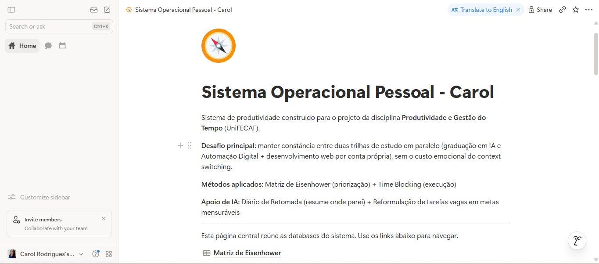
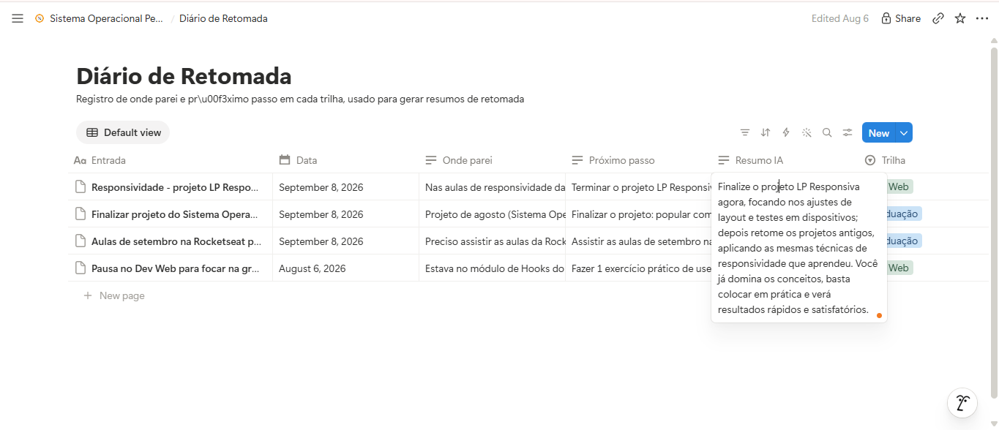
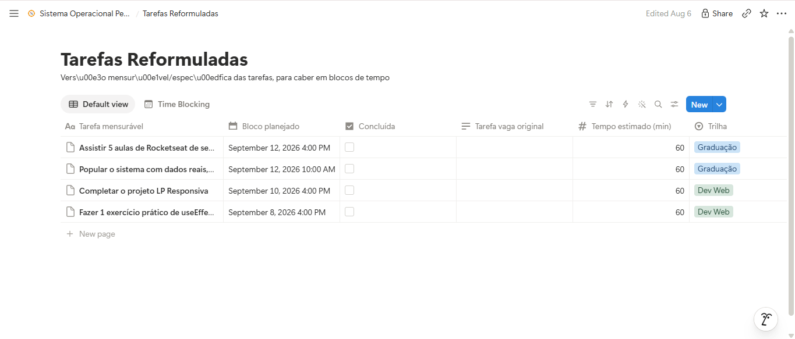

# Meu Sistema Operacional Pessoal
### Utilizando IA para Gerenciar Tempo, Comunicação e Produtividade

Projeto da disciplina **Produtividade e Gestão do Tempo** (UniFECAF).

---

## 1. Descrição do sistema

Este é um Sistema Operacional Pessoal (POS) criado para resolver um desafio
específico: manter **constância** entre duas trilhas de estudo simultâneas
(graduação em IA e Automação Digital + desenvolvimento web por conta própria),
sem o custo emocional de perder o fio da meada ao trocar de contexto entre elas.

O sistema combina dois métodos de produtividade — **Matriz de Eisenhower**
(prioriza o que é urgente x importante) e **Time Blocking** (reserva horários
fixos de execução) — com um **agente de IA** que automatiza três decisões
sempre que registro uma retomada de estudo: resumir onde parei, classificar
a próxima tarefa na matriz, e sugerir o próximo horário livre pra executá-la.

## 2. Ferramentas utilizadas

| Ferramenta | Papel no sistema |
|---|---|
| **Notion** | Ferramenta central — reúne Matriz de Eisenhower, Diário de Retomada e Tarefas Reformuladas num só lugar (antes espalhado entre Google Calendar, To Do e Notion) |
| **Node.js** | Roda o agente de automação (`notion-resumo-retomada`) |
| **Notion API** (`@notionhq/client`) | Lê e escreve nas databases do sistema |
| **Groq API** (modelo `openai/gpt-oss-20b`) | Motor de IA do agente — gera resumos, classifica tarefas e decide urgência/importância, gratuito |

## 3. Fluxo de organização

**Estrutura no Notion** (página central: *Sistema Operacional Pessoal*):

- **Matriz de Eisenhower** — database com as tarefas ativas, agrupadas por
  quadrante (Fazer agora / Planejar / Delegar / Eliminar), separadas por trilha
  (Graduação, Dev Web, Freelance, Compras Coletivas)
- **Diário de Retomada** — registro de "onde parei" e "próximo passo" toda vez
  que pauso uma trilha; é aqui que o agente de IA lê o contexto
- **Tarefas Reformuladas** — versão mensurável das tarefas, com data/hora do
  bloco de estudo (visualização de calendário = Time Blocking)

**Fluxo do agente de IA**, disparado sempre que uma nova entrada aparece no
Diário de Retomada sem resumo:

```
Nova entrada no Diário de Retomada
        │
        ▼
1. Gera resumo de retomada (Groq)  ──────▶  escreve em "Resumo IA"
        │
        ▼
2. Classifica urgente/importante   ──────▶  cria ou atualiza linha
   e sugere tarefa mensurável           na Matriz de Eisenhower
        │
        ▼
3. Cruza a disponibilidade fixa    ──────▶  cria bloco de horário
   com os horários já ocupados          em Tarefas Reformuladas
```

A disponibilidade fixa (dias/períodos livres por trilha, e horários sempre
bloqueados por freelance/compras coletivas) fica configurada em
`disponibilidade.js`, editável conforme a rotina muda.

## 4. Prints


 Página central do Sistema Operacional Pessoal
 Matriz de Eisenhower (board por quadrante)
 Diário de Retomada com o campo "Resumo IA" preenchido
 Tarefas Reformuladas (calendário/Time Blocking) com bloco sugerido
[ ] Terminal rodando `node index.js` com os 3 passos completos

## 5. Como utilizar a solução

**No Notion (uso diário):**
1. Ao pausar uma trilha de estudo, crie uma entrada no **Diário de Retomada**
   com "Onde parei" e "Próximo passo"
2. Rode o agente (abaixo) — ele preenche o resumo, classifica na matriz e
   sugere o horário automaticamente
3. Consulte a **Matriz de Eisenhower** pra saber o que fazer agora, e o
   **Time Blocking** pra ver quando

**Rodando o agente de IA:**
```bash
cd notion-resumo-retomada
npm install
cp .env.example .env   # preencha com seu token do Notion e chave do Groq
node index.js
```

O script processa automaticamente todas as entradas do Diário de Retomada
que ainda não têm resumo, uma de cada vez.
